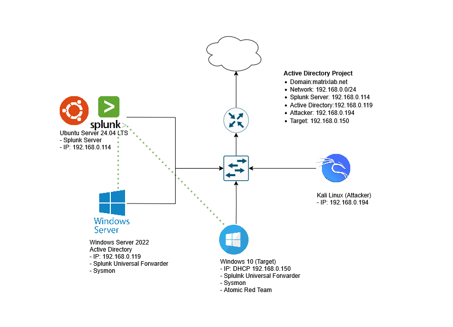

# 🔍 Active Directory Detection Lab with Splunk, Sysmon, and Atomic Red Team

## 🎯 Lab Objective

This lab simulates a **realistic enterprise environment** for red team vs. blue team exercises. You'll build a full **Active Directory (AD)** domain, simulate **brute-force attacks** using Kali Linux, and monitor events using **Splunk**. The goal is to understand attack behaviors and improve detection using real-world tools like **Atomic Red Team** and the **MITRE ATT&CK Framework**.

> ⚙️ **Note:** This entire lab environment was built using **Proxmox VE**, instead of VirtualBox or VMware.  

> 🖥️ But you can still follow this guide using **VirtualBox** or **VMware** — all steps remain the same.

---

## 🛠️ Tools & Technologies Used

- **Windows Server 2019** – Domain Controller (AD DS, DNS)
- **Windows 10** – Domain-joined Client
- **Kali Linux** – Attacker machine (Hydra for brute-force)
- **Splunk** – Log aggregation and security monitoring
- **Atomic Red Team** – Simulate post-exploitation techniques
- **MITRE ATT&CK** – Threat technique mapping

---

## 🔄 Lab Workflow Breakdown

## 📁 Project Structure

| Part                                   | Title                                                                  | Summary                                                                                                                                |
| -------------------------------------- | ---------------------------------------------------------------------- | -------------------------------------------------------------------------------------------------------------------------------------- |
| [Part 1](docs/splunk_setup.md) | **Installing and Configuring Splunk Enterprise & Universal Forwarder** | Set up Splunk Enterprise on Ubuntu Server and configure the Universal Forwarder on Windows to forward Sysmon and event logs.           |
| [Part 2](docs/active_directory_setup.md)       | **Setting Up Active Directory on Windows Server**                      | Install and promote Windows Server 2016 to a Domain Controller, configure users and DNS, and join a Windows 10 machine to the domain.  |
| [Part 3](docs/security_testing.md)  | **Brute Force Attack Simulation & Atomic Red Team Testing**            | Use Kali Linux and Hydra to simulate RDP brute-force attacks, deploy Atomic Red Team scripts, and validate detections via Splunk logs. |

### Infrastructure Setup
- Configure **static IPs** for all machines
- Install **Active Directory Domain Services (AD DS)**
- Promote the server to a **domain controller**
- Create **Organizational Units (OUs)** and users
- Join a **Windows 10 client** to the domain

---

### Brute Force Attack Simulation
- Assign a static IP to **Kali Linux**
- Install and configure **Hydra**
- Run an **RDP brute-force attack** on a domain user
- Verify **successful login attempts** in Hydra
- Correlate **Event ID 4625/4624** in Splunk logs

---

### Detection with Atomic Red Team
- Install **Atomic Red Team** on Windows 10
- Run tests for:
  - `T1136.001` – Create Local User
  - `T1059.001` – PowerShell Execution
- Search Splunk for relevant **attack patterns**
- Identify **log visibility gaps** and refine detection

---

## 🎯 Learning Objectives

* Deploy a complete detection lab with Active Directory and Splunk.
* Simulate red team attacks like brute force and PowerShell execution.
* Validate detections with real-world MITRE techniques using Atomic Red Team.
* Strengthen your understanding of endpoint logging, detection engineering, and adversary behavior.

---

## SOC Incident Reports

As part of this lab, simulated attacks were performed and analyzed to demonstrate detection and response workflows.

Detailed SOC-style incident reports can be found in the [`incidents/`](./incidents) folder.  

Currently included:

- **Incident 1:** Detection and Investigation of RDP Brute-Force Attack Against Active Directory User

---

🙏 Thanks to the MYDFIR YouTube channel — I followed and recreated this lab setup based on their awesome content.
