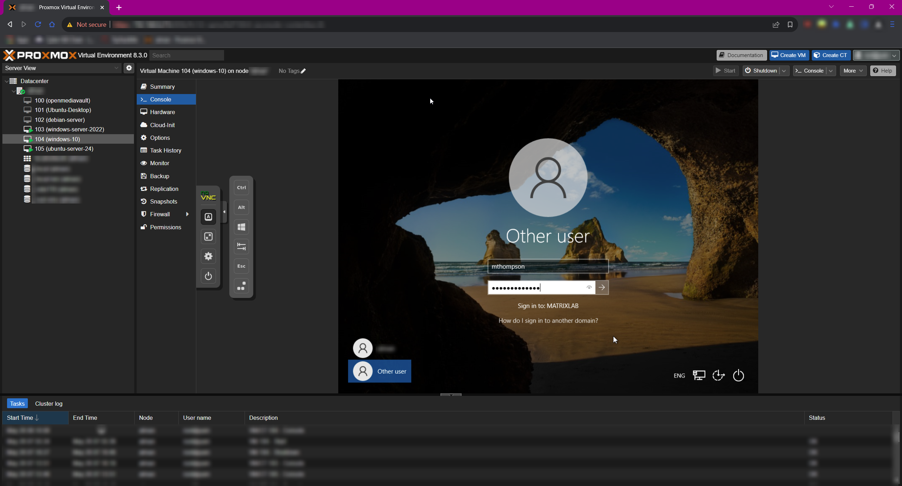

# Part 2: Setting Up Active Directory on Windows Server

---

## **Part 1: Setting Up a Static IP on the Server**

### 1. Set a Static IP Address

* Right-click the **network icon** in the bottom-right corner → **Open Network & Internet Settings**.
* Click **Change adapter options**.
* Right-click the active network interface → **Properties**.
* Double-click **Internet Protocol Version 4 (TCP/IPv4)**.
* Select **Use the following IP address** and enter:

  * **IP Address:** `192.168.0.119`
  * **Subnet Mask:** `255.255.255.0`
  * **Default Gateway:** `192.168.0.1`
  * **Preferred DNS Server:** `8.8.8.8`
* Click **OK** → **OK** to save.

---

### 2. Verify Network Connectivity

* Open **Command Prompt**.
* Run `ipconfig` to confirm the IP is correctly applied.
* Run `ping google.com` to check internet access.
* Run `ping 192.168.0.114` to verify net connectivity to the Splunk server.

> 💡 **Tip**: If pings between Windows systems fail, enable **ICMP Echo Requests** in Windows Firewall.
> Navigate to **Control Panel** → **Windows Defender Firewall** → **Advanced Settings** → **Inbound Rules** → Enable **"File and Printer Sharing (Echo Request - ICMPv4-In)"**.

---

## **Part 2: Installing Active Directory Domain Services (AD DS)**

### 1. Open Server Manager

* Click the **Server Manager** icon (flag icon on the taskbar or start menu).

---

### 2. Add the AD DS Role

* Click **Manage** → **Add Roles and Features**.
* Select **Role-based or feature-based installation** → **Next**.
* Choose the default server → **Next**.
* Check **Active Directory Domain Services**.
* Click **Add Features** when prompted.
* Click **Next** → **Next** → **Next**, then **Install**.

* Wait for the installation to complete.

---

## **Part 3: Promoting the Server to a Domain Controller**

### 1. Promote the Server

* After AD DS installs, click the **notification flag** in Server Manager.
* Click **Promote this server to a domain controller**.

---

### 2. Configure a New Forest

* Select **Add a new forest**.
* Enter **Root domain name**: `matrixlab.net`.
* Click **Next**.

---

### 3. Set Domain Controller Options

* Leave default selections.
* Set a **DSRM (Directory Services Restore Mode)** password.
* Click **Next** through the remaining steps until the **Prerequisites Check** completes.

---

### 4. Install and Reboot

* Click **Install**.
* The server will **automatically restart** after installation. This is expected.

---

### 5. Verify Domain Controller Status

* After reboot, log in and confirm that the domain name (`MATRIXLAB\Administrator`) appears at the login screen.

---

## **Part 4: Creating Users & Organizational Units (OUs)**

### 1. Open Active Directory Users and Computers

* In **Server Manager**, click **Tools** → **Active Directory Users and Computers**.

---

### 2. Create Organizational Units (OUs)

* In the ADUC console, right-click the domain name (`matrixlab.net`) → **New** → **Organizational Unit**.
* Name the OU (e.g., `IT`, `HR`, `Finance`) → Click **OK**.

---

### 3. Create Users

* Right-click on an OU (e.g., `Finance`) → **New** → **User**.
* Fill in:

  * **First Name**: `Michael`
  * **Last Name**: `Thompson`
  * **User logon name**: `MThompson`
* Click **Next**, set a password.
* **Uncheck** “User must change password at next logon” (for lab purposes) → Click **Finish**.

---

## **Part 5: Joining a Windows 10 Machine to the Domain**

### 1. Change DNS Settings on the Client Machine

* Open **Network Settings** → **Change adapter options**.
* Right-click the active adapter → **Properties** → Double-click **IPv4**.
* Set **DNS Server** to the domain controller’s IP: `192.168.10.7`.
* Click **OK**.

---

### 2. Join the Domain

* Open **System Properties** (search “PC” → **Properties** → **Advanced system settings**).
* Under **Computer Name**, click **Change**.
* Select **Domain** and enter: `matrixlab.net`.
* When prompted, enter credentials: `matrixlab.net\Administrator`.
* Restart the machine when prompted.

---

### 3. Log in as a Domain User

* After reboot, select **Other User** at the login screen.
* Enter:

  * **Username:** `matrixlab\MThompson`
  * **Password:** \[password you set earlier]

---

## ✅ Next Steps Preview

* Configure **Kali Linux** to run brute-force attacks on the domain.
* Set up **Atomic Red Team** on the Windows machine to generate events and test Splunk log collection.
