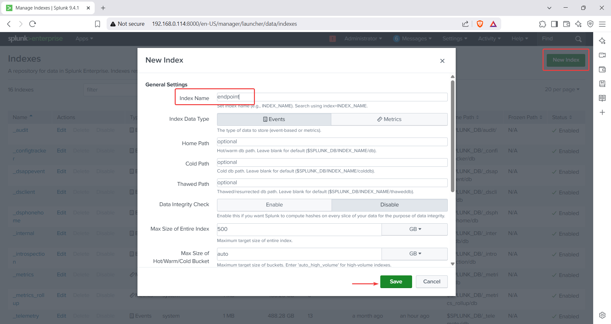

# 🛠️ Part 1: Installing and Configuring Splunk Enterprise & Universal Forwarder on Ubuntu and Windows

This guide walks you through setting up:

* **Splunk Enterprise** on an Ubuntu Server
* **Splunk Universal Forwarder** on a Windows 10 machine
* **Sysmon** for advanced event monitoring
* Includes static IP configuration and verification steps

---

## 🔧 Prerequisites

* Ubuntu Server 20.04+ installed and accessible via SSH (Optional)
* Kali Linux (or another Linux system) for transferring files via SCP (Optional)
* Windows 10 machine on the same network
* Splunk account credentials (free to create)

---

## 📡 Part 1: Ubuntu Server Setup with Splunk Enterprise

---

### Step 1: Configure a Static IP Address

1. Edit the Netplan config file:

   ```bash
   sudo nano /etc/netplan/00-installer-config.yaml
   ```

   > *Note: It may be named `50-cloud-init.yaml` on some systems.*

2. Example static IP configuration:

   ```yaml
   network:
     ethernets:
       enp0s3:
         dhcp4: no
         addresses: [192.168.0.114/24]
         nameservers:
           addresses: [8.8.8.8]
         routes:
           - to: default
             via: 192.168.0.1
     version: 2
   ```

3. Apply the configuration:

   ```bash
   sudo netplan apply
   ```

4. Verify IP address:

   ```bash
   ip a
   ```

5. Test connectivity:

   ```bash
   ping google.com
   ```


---

### Step 2: SSH into Ubuntu Server from Kali

```bash
ssh username@192.168.0.114
```


---

### Step 3: Download & Install Splunk Enterprise

1. Visit the [Splunk Website](https://www.splunk.com/) → Login → Products → Free Trials → Splunk Enterprise
2. Download the `.deb` file for Linux


3. Transfer it to Ubuntu via SCP:

   ```bash
   scp ~/Downloads/splunk-9.1.1-linux-2.6-amd64.deb user@192.168.0.114:/tmp/
   ```
   Note: I downloaded the Splunk Enterprise file on my Kali Linux machine and then shared it with Ubuntu Server using SCP (Secure Copy Protocol).

4. Install Splunk:

   ```bash
   cd /tmp/
   sudo dpkg -i splunk-9.1.1-linux-2.6-amd64.deb
   ```

---

### Step 4: Start and Configure Splunk

1. Start Splunk and accept the license:

   ```bash
   cd /opt/splunk/bin/
   sudo ./splunk start --accept-license
   ```

2. During setup:

   * Create admin username
   * Set a strong password

3. Enable auto-start:

   ```bash
   sudo ./splunk enable boot-start
   ```
---

## 🪟 Part 2: Windows 10 Universal Forwarder + Sysmon Setup

---

### Step 1: Rename PC (Optional but Recommended)

1. Go to:
   `This PC → Properties → Rename this PC → Set as windows-10 → Restart`


---

### Step 2: Set a Static IP on Windows 10

1. Go to:
   `Network icon → Network & Internet Settings → Change Adapter Options`

2. Right-click adapter → Properties → IPv4 → Properties

3. Set:

   * IP: `192.168.0.159`
   * Subnet: `255.255.255.0`
   * Gateway: `192.168.0.1`
   * DNS: `8.8.8.8`

4. Verify:

   ```cmd
   ipconfig
   ```


---

### Step 3: Install Splunk Universal Forwarder

1. Visit [Splunk Downloads](https://www.splunk.com/en_us/download/universal-forwarder.html)
2. Download the 64-bit Windows installer
3. During installation:

   * Accept license
   * Choose "On-premises Splunk Enterprise instance"
   * Set username as `admin`, and generate a password
   * Skip deployment server
   * Set receiving indexer: `192.168.0.114`, port: `9997`

---

### Step 4: Install Sysmon

1. Download Sysmon from Microsoft Sysinternals

2. Use Olaf Hartong's [sysmonconfig.xml](https://github.com/olafhartong/sysmon-modular)

3. Save `sysmonconfig.xml` to Downloads

4. Extract Sysmon ZIP and navigate to folder:

   ```powershell
   cd C:\Users\atman\Downloads\Sysmon
   ```

5. Install Sysmon:

   ```powershell
   .\Sysmon64.exe -i ..\sysmonconfig.xml
   ```
---

### Step 5: Configure Universal Forwarder (inputs.conf)

1. Open Notepad as Administrator
2. Navigate to:
   `C:\Program Files\SplunkUniversalForwarder\etc\system\local\`
3. Create or edit `inputs.conf`:

```ini
[WinEventLog://Application]
index = endpoint
disabled = false

[WinEventLog://Security]
index = endpoint
disabled = false

[WinEventLog://System]
index = endpoint
disabled = false

[WinEventLog://Microsoft-Windows-Sysmon/Operational]
index = endpoint
disabled = false
renderXml = true
source = XmlWinEventLog:Microsoft-Windows-Sysmon/Operational
```


---

### Step 6: Restart the Splunk Forwarder Service

1. Open **Services** → Find `SplunkForwarder`
2. Change **Log On** tab to `Local System account`
3. Apply, then restart the service


---

## 🌐 Part 3: Final Splunk Web Configuration

---

### Step 1: Access Splunk Web Interface

* URL: `http://192.168.0.114:8000`
* Login using admin credentials set earlier


---

### Step 2: Create the `endpoint` Index

1. Go to:
   `Settings → Indexes → New Index`
2. Name it `endpoint` → Save


---

### Step 3: Enable Receiving on Port 9997

1. Go to:
   `Settings → Forwarding and Receiving → Configure Receiving`
2. Add port `9997` and save


---

### Step 4: Verify Data in Splunk

1. Go to:
   `Apps → Search & Reporting`

2. Search:

   ```spl
   index="endpoint"
   ```

3. You should see:

   * **Host**: `windows-10`
   * **Source**: Includes Sysmon logs and Windows Event Logs


---

## 🧠 Additional Resources

* [Official Splunk Docs](https://docs.splunk.com/)
* [Sysmon GitHub](https://github.com/Sysinternals/Sysmon)
* [Olaf Hartong's Sysmon Modular Config](https://github.com/olafhartong/sysmon-modular)

---

## 🧰 Troubleshooting Tips

* **Static IP not applying?** Reboot and re-check Netplan or IPv4 settings
* **No data in Splunk?**

  * Check `inputs.conf` paths and syntax
  * Verify SplunkForwarder is running
  * Ensure index `endpoint` exists and matches config
* **Check Splunk logs**:

  ```bash
  /opt/splunk/var/log/splunk/
  ```
